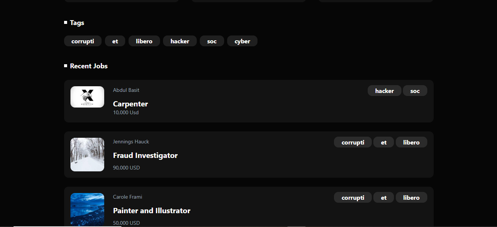

# Pixel Positions – Laravel Job Board Application

Pixel Positions is a dynamic **Job Board Application** built using the Laravel framework. It allows users to browse job listings, create new jobs, and manage employers and tags. The application implements **authentication**, **job CRUD operations**, and a **search feature**, all wrapped in a clean, responsive UI built with **Tailwind CSS**.

---

## 🚀 Features
- User Registration & Login
- Post, Edit, and Delete Job Listings
- Job Search by Title, Tags, and Company
- Employer Management
- Many-to-Many Relationship between Jobs and Tags
- Responsive UI with **Tailwind CSS**
- SQLite database for development

---

## 🛠️ Tech Stack
- **Backend:** Laravel 10, PHP 8+
- **Frontend:** Blade Templates, Tailwind CSS
- **Database:** SQLite (can be changed to MySQL)
- **Authentication:** Laravel Breeze / Default Auth
- **Version Control:** Git & GitHub

---

## 📸 Screenshots

### 🏠 Home Page


### 🏠 Home Page (Part 2)


### 🔐 Login Page


### 📝 Register Page


### ➕ Post a Job Page


---

## ⚙️ Installation Guide

Follow these steps to set up the project locally:

### 1️⃣ Clone the Repository
```bash
git clone https://github.com/basit398/pixel-positions-laravel-app.git
cd pixel-positions-laravel-app
```

### 2️⃣ Install Dependencies
```bash
composer install
npm install
```

### 3️⃣ Environment Setup
- Duplicate `.env.example` and rename it to `.env`
- Generate application key:
```bash
php artisan key:generate
```

### 4️⃣ Database Setup
- Update `.env` with your database credentials (or keep SQLite for quick start)
- Run migrations and seeders:
```bash
php artisan migrate --seed
```

### 5️⃣ Start the Development Server
```bash
php artisan serve
npm run dev
```
Access the app at **http://127.0.0.1:8000**.

---

## 🧪 Running Tests
```bash
php artisan test
```

---

## 📜 License
This project is open-sourced under the [MIT License](https://opensource.org/licenses/MIT).

---

### ✅ Author
Developed by **Basit**  
GitHub: [basit398](https://github.com/basit398)
